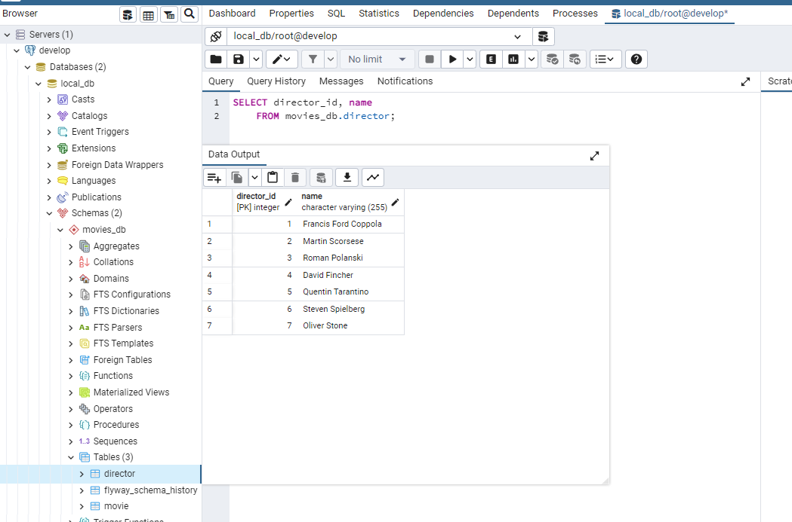

# spring-webflux-graphql
> The aim of this project is to demonstrate the GraphQL implementation with Spring Boot in conjunction with
> Spring Webflux and Spring Data R2DBC.
> 
> _Coded by [atromilen](https://github.com/atromilen)_

## About technology

**Spring for GraphQL**

Spring for GraphQL provides support for Spring applications built on GraphQL Java. It is a joint collaboration 
between the GraphQL Java team and Spring engineering.
All the documentation can be found [here](https://spring.io/projects/spring-graphql).

**Spring WebFlux**

This reactive-stack web framework was added later in version 5.0 to support fully non-blocking Reactive Streams back 
pressure. Spring WebFlux internally uses [Project Reactor](https://projectreactor.io/) and its publisher implementations 
[Flux](https://projectreactor.io/docs/core/release/api/reactor/core/publisher/Flux.html) and 
[Mono](https://projectreactor.io/docs/core/release/api/reactor/core/publisher/Mono.html).

**Spring Data R2DBC**

Spring Data R2DBC follows the [Reactive Relational Database Connectivity](https://r2dbc.io/) specification in order to 
integrate SQL database using reactive drivers.

**FlyWay**

This framework is used for database migration, allowing us to remodel our application's database schema in a reliably 
and easy way, having a backup for every change that our database schema suffer in the time. Documentation can be found
[here](https://flywaydb.org/).

**Makefile**

All the commands related to application running or gradle tasks were automated using makefiles. This is a convenience
and easy way to start all the infrastructure and build tasks entering only one command instead to follow several steps
to run the application. You can find documentation related to makefiles [here](https://makefiletutorial.com/).

## Prerequisites
Make you sure you have installed the following software:
- JDK 11
- [Docker](https://docs.docker.com/get-docker/).
- **Make** is part of some unix based OS. For windows, check it out on [Scoop](https://scoop.sh/#/apps?q=make&s=0&d=1&o=true) or
[Chocolatey](https://community.chocolatey.org/packages?q=make)
- Clone the source code in your local machine: 
```bash
git clone git@github.com:atromilen/spring-webflux-graphql.git
```

## Getting Started

1. To start the docker containers (postgreSQL and pgClient) and running of initial database migration (_Flyway_), enter 
the next command:
    ```bash
    make build
    ```

2. To start the Spring boot application, enter:
    ```bash
    make start
    ```
    Note: always it's possible to start a Spring Boot application directly in your preferred IDE or executing _**./gradlew bootRun**_

**Optional commands**

* If you need to stop the Spring Boot Application, open another terminal window and enter:
    ```bash
    make stop
    ```
Consider that the make stop also will stop the container services.

* If you want to stop the service containers and erase containers from your local docker, execute the next command:
    ```bash
    make clean
    ```

## Testing API with tool GraphiQL
**[GraphiQL](https://github.com/graphql/graphiql)** is a nice UI tool that allows us to test our GraphQL API in the 
browser and check the behavior of the API queries. In this example we have the query `getMoviesPaginated` that retrieve
movies stored in our database providing pagination (receiving as arguments page and size).

In your browser, go to [localhost:8080/graphiql](http://localhost:80), copy and paste and execute the query examples
displayed to next.

* A query to request the 1st page with 3 movies (query arguments `page: 0` and `size: 3`):
```bash
query {
  getMoviesPaginated(page: 0, size: 3){
    name
    year
  }
}
```


* Now, we will request the 2nd page with 3 movies (query arguments `page: 1` and `size: 3`), but also adding 
the field `director` to get its name.
```bash
query {
  getMoviesPaginated(page: 1, size: 3){
    name
    year
    director{
      name
    }
  }
}
```


The data displayed now is different. This is the power of GraphQL, allowing you to choose what data or fields to
request without coding more endpoints to represent data in different ways or views, as we use to do in REST APIS.


### PgAdmin config
If you want to visualize the database using the web client **PgAdmin** that is provided as service container, open a
browser and go to [localhost:80](http://localhost:80), entering as credentials **admin@localhost.com**/**admin** as 
user/password respectively.


Next, right click on **_Servers -> register -> Server..._**. In the **General** tab, enter a name for this server 
(I entered "develop" but you can use whatever you want).


In the **Connection** tab, enter the next information:
- Hostname/addres: postgres
- Username: root
- Password: root


The connection information is provided in the file docker-compose. It's important to notice that host must be **_postgres_** 
and not localhost, due you're pointing to the host exposed in the container service called **postgres**.

As you can see, you will have created the database **_local_db_** with the schema **_movies_db_** and the 2 tables
_director_ and _movie_. You can query over these tables (remember the flyway migrations included initial example data). 


